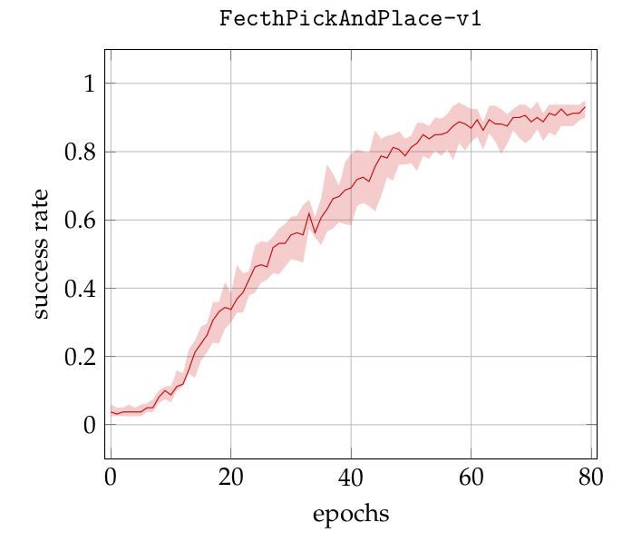

# Deep Reinforcement Learning for Grasping

The work presented here reproduces the results presented by [Plappert & al. (2018)](https://arxiv.org/abs/1802.09464). The idea is to use hinsight experience replay (HER) ([Andrychowicz & al. (2017)](http://papers.nips.cc/paper/7090-hindsight-experience-replay)) to learn four basic tasks.

## Installation

The following installation has been tested only on Ubuntu 18.04 LTS

1. install some dependencies

```shell
sudo apt-get update && sudo apt-get install cmake libopenmpi-dev python3-dev zlib1g-dev
```

2. clone the repository

```shell
git clone https://github.com/quenting44/drl_grasping.git
```

3. create a virtual environment, activate it and upgrade pip

```shell
cd drl_grasping
python3 -m venv env
source env/bin/activate
python -m pip install --upgrade pip
```

4. install tensorflow (or tensorflow-gpu if you have a CUDA-compatible gpu and proper drivers)

```shell
pip install tensorflow==1.14
# or
pip install tensorflow-gpu==1.14
```

5. install mujoco following the [instructions](https://github.com/openai/mujoco-py#install-mujoco)

6. install the remaining requirements.

```shell
pip install -r requirements.txt
```

## Usage

### Train

Define your own hyperparameters at the end of `train.py`. Then, run

```shell
mpirun -np 8 python main.py
```

The learning is distributed over 8 MPI workers.

### Play

To visualize the policy, make sure to fill the environment name and the path to the policy at the end of the `play.py` file. Then run

```shell
python play.py
```

## Results

With the envrionnement `FetchPickAndPlace-v1`


## Author

Quentin GALLOUÉDEC
